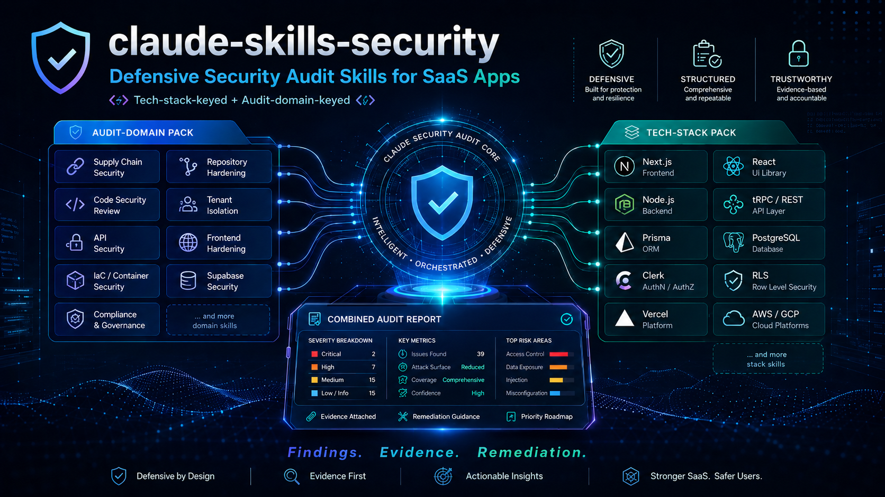

<p align="center">
  
</p>

<p align="center">
  <a href="SECURITY.md"></a>
  <a href="LICENSE"></a>
  <a href=".github/workflows/validate-all.yml"></a>
  <a href=".github/workflows/secret-scan.yml"></a>
  <a href=".github/tech-inventory.yml"></a>
  <a href="docs/ENHANCEMENT_PLAN.md"></a>
</p>

# claude-skills-security

A collection of **40 defensive security audit skills for Claude**, organized as two complementary packs.

> 🛡️ **Found a security issue in the skill content?** See [`SECURITY.md`](SECURITY.md) — private GitHub advisory or `hlarosesurprenant@gmail.com`. Acknowledged within 3 business days; Critical fixes within 14.

## At a glance

| Metric | Value |
|--------|-------|
| **Skills** | 40 total — 9 audit-domain + 31 tech-stack |
| **Check IDs** | 1,591 unique findings across the 40 skills |
| **Reference files** | 40 deep-dive companion docs |
| **Content** | 15,570 lines of authored audit guidance |
| **Tech inventory** | 61 tracked technologies with 141 cited sources ([`.github/tech-inventory.yml`](.github/tech-inventory.yml)) |
| **Drift watch** | 4 Critical · 21 High · 16 Medium · 16 Low — current as of 2026-05-24 |
| **CI** | Per-skill schema validation + inventory schema v3 validation ([`.github/workflows/validate-all.yml`](.github/workflows/validate-all.yml)) |
| **Secret scanning** | gitleaks on every PR + weekly full-history rescan ([`.github/workflows/secret-scan.yml`](.github/workflows/secret-scan.yml)) |
| **Security policy** | Responsible disclosure — see [`SECURITY.md`](SECURITY.md) |
| **License** | MIT — see [`LICENSE`](LICENSE) |

The packs answer different questions, and Claude picks skills from either (or both) based on what the user is asking:

| Pack | Skills | Organized by | Activates when |
|------|-------:|--------------|----------------|
| **[saas-security-pack](./saas-security-pack)** | 9 | Audit domain | "Review my supply chain", "Audit our RLS", "Check tenant isolation", "Compliance review" |
| **[appsec-stack-pack](./appsec-stack-pack)** | 31 | Technology stack | "Audit my Next.js app", "Review my Prisma queries", "Is my Clerk webhook safe", "Cloudflare Workers security", "Review my CORS / CSP / cookies" |

For a typical "audit my SaaS" request on a modern stack, both packs activate skills that work together — domain-keyed audits (RLS, supply chain) running alongside stack-keyed audits (Next.js, Prisma, Clerk). The quick example below shows 7 skills activating concurrently on a single audit request.

## Quick example

User asks: *"Audit my Next.js + Prisma + Clerk app on Vercel for security issues."*

Claude activates:
- `nextjs-security` (NXT-) — App Router, Server Actions, env exposure
- `prisma-orm-security` (PRI-) — raw queries, mass assignment, IDOR
- `clerk-security` (CLK-) — webhook signatures, key handling, middleware
- `vercel-platform-security` (VRC-) — env scoping, Deployment Protection, Cron
- `saas-code-security-review` (SCSR-) — generic auth/IDOR/SSRF patterns
- `saas-frontend-hardening` (SFH-) — CSP, cookies, headers
- `saas-tenant-isolation` (STI-) — multi-tenant data partitioning

Seven skills run, each emitting findings with its own prefix. The combined report is severity-sorted and de-duplicated.

## The 40 skills

### saas-security-pack — domain-keyed (9)

| Skill | Prefix | Covers |
|-------|--------|--------|
| `github-supply-chain` | GHSC | Actions pinning, dependabot, secret scanning, SBOM |
| `github-repo-hardening` | GHRH | Branch protection, environments, CODEOWNERS, signed commits |
| `saas-code-security-review` | SCSR | Auth, AuthZ, IDOR, SSRF, JWT, secrets, sinks, deserialization |
| `supabase-security-audit` | SUPA | RLS policies, SECURITY DEFINER, anon role exposure, storage policies |
| `saas-tenant-isolation` | STI | Per-tenant scoping across DB, cache, search, files, queues |
| `saas-api-security` | SAPI | REST conventions, rate limits, webhooks, idempotency, CORS |
| `saas-frontend-hardening` | SFH | CSP, cookies, CORS, headers, secrets in bundle |
| `iac-container-security` | IACS | Terraform, Dockerfile, Kubernetes manifests, image scanning |
| `saas-compliance-audit` | SCMP | SOC 2, GDPR/CCPA, evidence collection, audit logs |

### appsec-stack-pack — tech-keyed (31)

**Frontend (7)**: react · nextjs · vite · vue-nuxt · svelte-sveltekit · angular · electron

**Backend Node (4)**: nodejs-express · nestjs · fastify · hono

**Backend Python (3)**: django · fastapi · flask

**Other backends (5)**: go · rails · laravel · spring-boot · dotnet-aspnetcore

**API protocols (3)**: graphql · trpc · websocket

**Data layer (3)**: prisma-orm · mongoose-mongodb · redis

**Auth providers (2)**: clerk · nextauth

**Edge/Cloud (3)**: vercel-platform · cloudflare-workers · aws-lambda

**Web platform (1)**: web-platform-security — CORS, CSP, COOP/COEP/CORP, modern cookies (SameSite, `__Host-`, CHIPS), Permissions-Policy, SRI, Trusted Types, HSTS, `postMessage`, iframe sandbox, Private Network Access, WebAuthn / Passkeys, FedCM. Sourced from web.dev / developer.chrome.com.

See [`appsec-stack-pack/README.md`](./appsec-stack-pack/README.md) for the full table with triggers.

## Skill format

Every skill follows the same shape:

```
<skill-name>/
├── SKILL.md            # YAML frontmatter + 5-phase audit workflow
├── references/         # Optional deep-dive companion docs
│   └── <topic>.md
└── assets/             # Optional scripts / fixtures
```

Every audit emits findings using the shared schema in each pack's `_shared/findings-schema.md`. Finding IDs are prefixed with a 3-letter skill code so combined reports don't collide — 40 unique prefixes across the two packs, 1,591 individual check IDs in total.

## Installation

Each pack is independently installable. For Claude Code:

```bash
cd ~/.claude/skills
git clone https://github.com/hlsitechio/claude-skills-security.git
# Use a specific pack:
cp -r claude-skills-security/saas-security-pack ./saas-security-pack
cp -r claude-skills-security/appsec-stack-pack ./appsec-stack-pack
```

For Claude Desktop or claude.ai, follow the platform's skill installation flow.

Each pack also has a `scripts/package_skills.sh` that produces per-skill `.zip` files in `dist/` for selective installation.

## Design principles

- **Defensive only.** Every skill is find-and-fix. No offensive content, no weaponized payloads.
- **One question per skill.** Skills don't try to cover the universe — each has a narrow trigger surface so Claude can route accurately.
- **Multi-skill orchestration.** A real audit often activates 5–7 skills concurrently. Finding ID prefixes prevent collision across all 40 skills; the combined report is severity-sorted.
- **Reproducible evidence.** Every finding has a file:line reference and a copy-pasteable remediation.

## Security

> 🛡️ This repository is the source of truth for **40 defensive security audit skills**. A flaw in the *content* (a check recommending an insecure pattern, a "GOOD" example with a subtle bug, a missing CVE reference) can propagate to downstream audits — so we treat content bugs as security issues.

### How to report (machine + human readable)

```
Contact: https://github.com/hlsitechio/claude-skills-security/security/advisories/new
Contact: mailto:hlarosesurprenant@gmail.com
Policy:  https://github.com/hlsitechio/claude-skills-security/blob/main/SECURITY.md
```

The same info is published in standards-compliant form at [`/.well-known/security.txt`](.well-known/security.txt) (RFC 9116) for automated scanners.

| Channel | Use when |
|---------|----------|
| [GitHub private vulnerability report](https://github.com/hlsitechio/claude-skills-security/security/advisories/new) | Preferred. Only the maintainer is notified; coordinated disclosure. |
| `hlarosesurprenant@gmail.com` (subject `[claude-skills-security]`) | Fallback if you don't have a GitHub account. |

**SLA:** acknowledged within 3 business days · triaged within 7 days · Critical fixes shipped within 14 days · 90-day coordinated disclosure unless otherwise agreed.

### In scope

- A check that **recommends an insecure pattern** as if it were safe.
- A "GOOD" code example with a subtle flaw that would land in a real audit report.
- A **missing CVE / advisory** for a tech tracked in [`.github/tech-inventory.yml`](.github/tech-inventory.yml) — particularly Critical / High severity ones referenced by upstream vendors.
- Any path that would lead a downstream user to deploy a vulnerable configuration.

### Out of scope

- "I'd phrase this differently" — open a PR.
- "Doesn't cover X" — open an issue.
- "Reference isn't from my favorite source" — open a PR with a better source.

Full policy: [`SECURITY.md`](SECURITY.md).

### Repo-side guarantees

- **CODEOWNERS** required review on every PR touching skill content, the tech inventory, CI workflows, or scripts ([`.github/CODEOWNERS`](.github/CODEOWNERS)).
- **Secret scanning** on every PR + weekly full-history rescan: gitleaks with project-specific allowlist + custom entropy scanner ([`.github/workflows/secret-scan.yml`](.github/workflows/secret-scan.yml)).
- **Schema validation** on every PR: SKILL.md frontmatter + Claude upload constraints (description ≤1024 chars, no XML-like tags) + tech-inventory schema v3 ([`.github/workflows/validate-all.yml`](.github/workflows/validate-all.yml)).
- **Eat-our-own-dogfood CI**: minimal `permissions: {}` at workflow level, `contents: read` per job, all third-party actions SHA-pinned (the same supply-chain guidance the skills teach).

## Companion projects

- **[Crowbyte](https://crowbyte.io)** — Offensive security platform (red team / blue team / purple team modes)
- **[Methora](https://methora.com)** — Reference implementation of the Interpretation Contract Layer

## Contributing

See [`CONTRIBUTING.md`](./CONTRIBUTING.md) for skill format, triggers, and contribution flow.

## License

MIT — see [`LICENSE`](./LICENSE).
